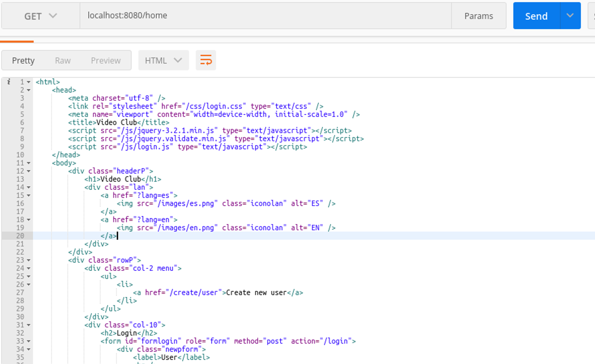
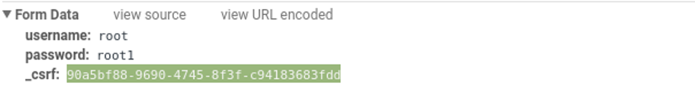
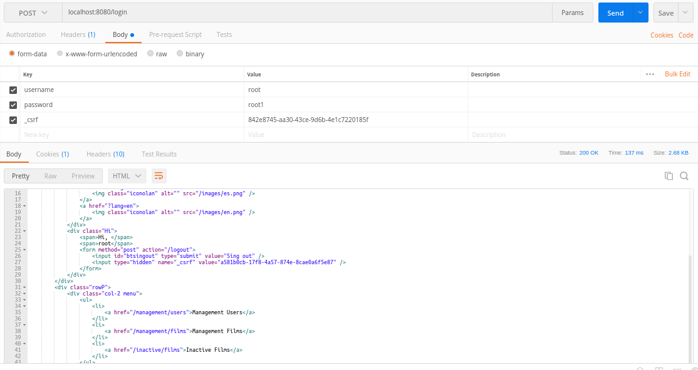
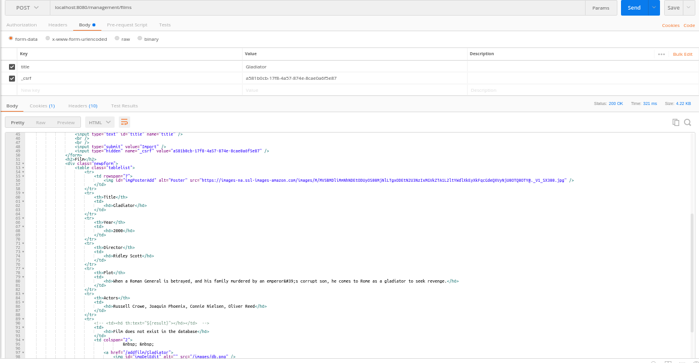

# Arquitecturas escalables y tolerante a fallos

En esta práctica se van a realizar medidas y estudios sobre las diferentes arquitecturas
vistas en clase, midiendo y jusfiticando el uso de cada una de las arquitecturas.

## Arquitectura centralizada

Como primera parte del ejercicio usaremos postman como cliente web para comprobar
el correcto funcionamiento de nuestro servicio web.

    # [Descargar postman de la página oficial](https://app.getpostman.com/app/download/linux64?_ga=2.91368154.1961962681.1514476967-828309672.1514476967)
    $ tar -xvzf Postman-linux-x64-5.5.0.tar.gz
    $ ./Postman/Postman

Por otro lado arrancamos el servicio web del video club.

    # docker start mysql
    $ mvn spring-boot:run

Una vez arrancado el servicio web debemos comprobar el correcto funcionamiento del servicio
comprobando los métodos del controlador usando el cliente postman.

### Testeo del controlador a través de postman.

La primera petición HTTP será un GET a la página home, el servicio web nos devolverá la vista
HTML con la página de inicio del servicio web. Donde se puede crear el usuario o comprobar una película
para ver.

Si intentamos acceder a la página de administración de usuarios sin estar autenticados frente al servicio web como usuarios administradores
nos redigirá a la página de login por no estar todavía autenticados, relizando cualquier tipo de petición post get put delete etc...

    POST localhost:8080/management/films
    GET localhost:8080/management/films

Ambas peticiones nos llevan a la misma plantilla:

    login.html

Una vez comprobada la autenticación del servicio web vamos a loguearnos deberemos rellenar en una petición post los siguientes campos en formato
body form-data. No es del todo obvio la autenticación hemos necesitado realizar una depuración de la autenticación en un cliente web para comprobar
que campos son los que realmente se mandan al servidor web.

De esta manera seremos capaces de loguearnos frente al servicio web con la configuración de autenticación de spring boot. El servicio web nos
responderá con la página de inicio dándonos la bienvenida al VideoClub. Una vez logueados en el servicio web como usuario administrador podriamos
acceder a todas las páginas de administración del VideoClub.

Una vez logueados vamos a acceder a la página de administración de películas del video club.

    GET localhost:8080/management/films

El servidor web nos devuelve la vista de administración de películas del VideoClub ahora realizaremos una petición para una película nueva dentro del
VideoClub.

En esta petición hemos obtenido primero la vista de administración de peliculas y en esta segunda petición rellenaremos el formulario de películas
para obtener una nueva película en el video club a través de postman. Debermos cambiar el _csrf de la petición HTTP al que se nos dío en la petición
get a la vista management-films para poder acceder a la petición de formulario de búsqueda de películas de administración.

