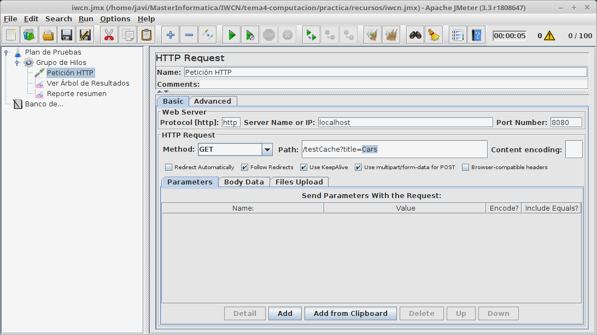
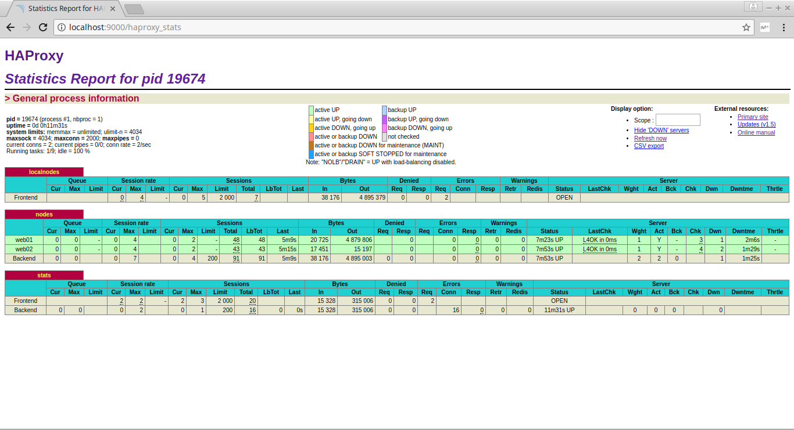

# Arquitecturas escalables y tolerante a fallos

En esta práctica se van a realizar medidas y estudios sobre las diferentes arquitecturas
vistas en clase, midiendo y jusfiticando el uso de cada una de las arquitecturas.

## Arquitectura centralizada

Como primera parte del ejercicio usaremos postman como cliente web para comprobar
el correcto funcionamiento de nuestro servicio web.

    # [Descargar postman de la página oficial](https://app.getpostman.com/app/download/linux64?_ga=2.91368154.1961962681.1514476967-828309672.1514476967)
    $ tar -xvzf Postman-linux-x64-5.5.0.tar.gz
    $ ./Postman/Postman

Por otro lado arrancamos el servicio web del video club.

    # docker start mysql
    $ mvn spring-boot:run

Una vez arrancado el servicio web debemos comprobar el correcto funcionamiento del servicio
comprobando los métodos del controlador usando el cliente postman.

### Testeo del controlador a través de postman.

La primera petición HTTP será un GET a la página home, el servicio web nos devolverá la vista
HTML con la página de inicio del servicio web. Donde se puede crear el usuario o comprobar una película
para ver.

Si intentamos acceder a la página de administración de usuarios sin estar autenticados frente al servicio web como usuarios administradores
nos redigirá a la página de login por no estar todavía autenticados, relizando cualquier tipo de petición post get put delete etc...

    POST localhost:8080/management/films
    GET localhost:8080/management/films

Ambas peticiones nos llevan a la misma plantilla:

    login.html

Una vez comprobada la autenticación del servicio web vamos a loguearnos deberemos rellenar en una petición post los siguientes campos en formato
body form-data. No es del todo obvio la autenticación hemos necesitado realizar una depuración de la autenticación en un cliente web para comprobar
que campos son los que realmente se mandan al servidor web.

De esta manera seremos capaces de loguearnos frente al servicio web con la configuración de autenticación de spring boot. El servicio web nos
responderá con la página de inicio dándonos la bienvenida al VideoClub. Una vez logueados en el servicio web como usuario administrador podriamos
acceder a todas las páginas de administración del VideoClub.

Una vez logueados vamos a acceder a la página de administración de películas del video club.

    GET localhost:8080/management/films

El servidor web nos devuelve la vista de administración de películas del VideoClub ahora realizaremos una petición para una película nueva dentro del
VideoClub.

En esta petición hemos obtenido primero la vista de administración de peliculas y en esta segunda petición rellenaremos el formulario de películas
para obtener una nueva película en el video club a través de postman. Debermos cambiar el _csrf de la petición HTTP al que se nos dío en la petición
get a la vista management-films para poder acceder a la petición de formulario de búsqueda de películas de administración.

Por último nos deslogueremos accedermos como un usuario sin privilegios de administración e intentaremos acceder a una página de administración y comprobaremos
que no tendremos acceso...

    GET localhost:8080/login?logout -> Nos devuelve a la página de login del servicio.
    POST localhost:8080/login
            - username : user
            - password : user1
            - _csrf : a581b0cb-17f8-4a57-874e-8cae0a6f5e87

Una vez realizadas estas dos peticiones estaremos logueados como un usuario normal sin privilegios de administración. Si ahora intentamos acceder a una página de administración
nos devolverán la vista de acceso denegado del servicio web.

### Uso de Jmeter en escalado vertical

Como primer paso instalamos jmeter desde la consola de comandos como hicimos en postman

      $ tar -xvzf apache-jmeter-3.3.tgz
      $ ./apache-jmeter-3.3/bin/jmeter

Podremos comprobar nuestro servidor y ver cuantas peticiones es capaz de aguantar, utilizando el recurso de la práctica para relizar las peticiones http al servidor web a través de
jmeter.

Después de utilizar jmeter por primera vez añadiremos el servidor web en la máquina virtual a través de github, instalando las dependencias necesarias mvn docker etc...

      $ install java8...
      $ install docker...

Una vez instalado y arrancado el servidor web realizaremos las pruebas jmeter comprobando la escalabilidad vertical de la aplicación web. Configuraremos la máquina virtual en
modo host-only y realizaremos la petición a jmeter a través de la interfaz virtual que conecta la máquina host con la guest a traves de VirtualBox.

Realizaremos una primera prueba de estrés al servidor con una máquina de 512 MB de memoria RAM y con un grupo de 10 hilos...

Después de realizar una primera prueba que funciona con 10 hilos realizaremos los hitos del enunciado.

  - Con 100 hilos la aplicación funciona correctamente y no delays en las peticiones a los clientes.
  - Con 200 hilos la aplicación tiene delays en las peticiones en los clientes se puede comprobar por el tiempo
      que tardan en acabar la peticiones los hilos a través de la GUI y por el resumen final donde obtenemos una desviación de 708.60
      que indica una variación en el tiempo de respuesta de los hilos muy significativa. También podemos medir el tiempo de respuesta
      a través del througput que está aproxiadamente en 10 segundos

  - Con 300 hilos la aplicación deja de funcionar. El servidor lanza excepciones hasta que llega a java.lang.OutOfMemoryError: Java heap space
      lo que significa que la JVM del servidor web se ha quedado sin espacio en memoria. Los hilos de jmeter quedarán bloqueados y tendremos una
      cantidad de error del 100% (en este caso) en el test de estrés de jmeter...

En las peticiones HTTP también veremos que hemos recibido mensajes de error de todas las peticiones de los hilos simulando cliente de jmeter...

Una vez comprobado el uso de jmeter y cuando nos salimos de límites de memoria en el servidor web con 512mb de RAM. Vamos a realizar las mismas pruebas
aumentando la memoria de la máquina virtual...

Probaremos primero donde nos quedamos en el límite anterior de esta manera comprobaremos si el aumento de la memoria de la máquina consigue realizar un
escalado en la cantidad de peticiones que es capaz de recibir el servidor web.

En esta patanlla podemos ver que el aumento de la memoria RAM hace que el servidor sea capaz de soportar 300 peticiones de manera concurrente sin tener problemas
de límites de memoria en la JVM dando como resultado exitosas todas las peticiones HTTP realizadas desde los hilos de jmeter.

Ahora relizaremos los hitos de la práctica respecto a la máquina con 1GB de memoria RAM.

  - Con 1000 hilos la máquina recibe todas las peticiones y es capaz de contestar a todos los clientes. En ambos casos el througput disminuye al realizar las peticiones
  con un número N de clientes alto, es decir la cantidad de paquetes que es capaz de envíar correctamente por segundo disminuye, esto se debe a que el servidor únicamente
  tiene una interfaz de red por donde enviar las respuestas teniendo un cuello de botella en el envío y recibo de paquetes por la red.

  - Con 2000 hilos la aplicación ya entra dentro de los límites, es decir no es capaz de manejar tantas peticiones de manera simultánea dando excepciones de copia de memoria
  en Arrays y por tanto un error de límites de memoria de la JVM donde está ejecutando el servicio web. Los clientes reciben una petición de que el socket al que intetna conectarse
  se en cuentra cerrado. El througput decae debido a que la cantidad de paquetes que es capaz de contestar por segundo disminuye y el número de errores del servidor aumenta.

#### Conclusiones extraidas

  - El througput mejora cuando obtenemos un mayor espacio de memoria realizando un mayor número de peticiones aceptadas por segundo y mejorando los tiempos de respuesta en los clientes
  por cada petición que realizan al servidor.

  - El aumento de la memoria consigue realizar un mayor número de peticiones de manera simultánea o concurrente dentro del servidor web, hemos llegado de 200 conexiones concurrentes en un
  servidor con 512mb de RAM a 1000 peticiones simultáneas en un servidor con 1GB de memoria RAM.

Las arquitecturas centralizadas son escalables siempre que mejoremos los recursos con los que cuenta la máquina optimizando los tiempos de respuesta del servicio o sistema. Sin embargo no son tolerantes
a fallos. Si el servidor que mantiene el servicio web falla los usuarios se quedarán sin servicio. Al igual que el coste de tener un servidor con más recursos puede resultar más alto que tener replicas con
balanceadores de carga.

# Separación entre la base de datos y el servidor web

En esta arquitectura vamos a crear una nueva máquina virtual donde situaremos la base de datos. El servidor deberá ser configurado para acceder a la base de datos externa por su dirección ip en el fichero
application.yml donde se definde la conexión con JPA. Una vez conetado el servidor a la base de datos comprobaremos con jmeter los nuevos tiempos, cantidad de petciones concurrentes etc... Las máquinas
virtuales seguirán el mismo esquema de red estarán en una red host-only donde estarán conectadas entre sí y con el host que es donde estamos lanzando los clientes con jmeter.

Ambas máquinas cuentan con 1GB de memoria RAM.

  - Con 1000 hilos el servidor funciona de forma fluida con un througput alto, indicando que los clientes reciben la petición que realizan de manera rápida, además de no tener errores con ninguna de las
  peticiones que se realizan desde los clientes.

  - Con 2000 hilos el througput disminuye, indicando una mayor lentitud en la respuesta del servidor a los clientes y seguimos teniendo problemas de memoria ya que obtenermos un java.lang.OutOfMemoryError: Java heap
  space de la JVM en la máquina que soporta el servidor web.

¿Qué ha cambiado respecto al ejemplo anterior y porqué?

Para responder esta pregunta debemos realizar la comparación de resultados entre las medidas de las dos arquitecturas la que tiene la base de datos separada y la que no. Una de las principales diferencias es que en este caso
la base de datos sigue funcinando. Si algún otro servicio estuviera ejecutando desde otra máquina a la misma base de datos el segundo servicio no se veria afectado por la caida del servidor web.

Vamos a comprobar el funcionamiento de las dos máquinas con 1000 hilos de ejecución.

Esta es la ejecución con la base de datos separada del servidor web como primera arquitectura horizontal.

Esta es la ejecución con la base de datos en la misma máquina que el servidor web.

### Conclusiones extraidas

En ambos casos las peticiones de los clientes son respondidas, sin embargo, el uso de la base de datos en una máquina diferente tiene una mejora en el tiempo de respuesta a los clientes que se puede observar en el througput
que es mayor en el primer escenario con la base de datos separada y el tiempo total de respuesta que es menor también en el primer escenario con la base de datos separada. De todas maneras el cambio más significativo es que
al caerse el servidor web con la base de datos separada. La base de datos no se ve afectada por la caida pudiendo dar servicio a otros servidores que estén usando la base de datos en ese momento.

También comentar que el envío y recibo de datos en el primer ejemplo es mayor ya que al tener la base de datos separada hay algo más de tráfico de red, en este ejemplo la latencia entre máquinas es nula cosa que deberíamos tener
en cuenta a la hora de realizar las pruebas. No podemos asumir que no hay latencia entre la base de datos y el servidor web en unas pruebas de rendimiento reales.

# Arquitectura separación entre aplicación y BD con caché

Para este ejemplo hemos creado un endpoint en el servidor web que simula un procesamiento de datos complejo que tiene un tiempo de respuesta alto, añadiendo un sleep antes de el envío de respuesta de un String en un método
testCache. Añadimos el método y la notación @Cacheable para tener cacheada la respuesta.

      // Punto de entrada al programa debemos habilitar la cache.

      @SpringBootApplication
      @EnableCaching
      public class VideoClubApp {
            public static void main(String[] args) {
                  SpringApplication.run(VideoClubApp.class, args);
            }
      }

      // En el controlador realizamos un metodo que simule un servicio que tenga
      // latencia o tarde un tiempo en contestar y que esté cacheado...

      @Cacheable("test")
	@RequestMapping(value = "testCache", method = RequestMethod.GET)
	public ModelAndView testCache(@RequestParam String title) {
		simulateSlowService();
		return new ModelAndView(MANAGEMENT_FILMS);
	}

	private void simulateSlowService() {
		try {
			Thread.sleep(5000);			
		} catch (InterruptedException e) {
			e.printStackTrace();
		}		
	}

Una vez añadido el método cache con una entrada, el identicador de las películas comprobaremos el uso de cache con meter. Si usamos la máquina host y un conjunto de hilos pequeño comprobaremos cual es problema en el uso
del servicio lento en las mediciones con jmeter. La primera petición (o una de ellas tarda 5000 ms) si luego volvemos a lanzar las misma peticiones con la petición ya cacheada las peticiones no tardan más de 12 ms en
recibir respuesta del servidor.

Esta primeras 100 peticiones una de ellas o varias han durado un total de 5000 ms máximo tiempo de respuesta...

En esta segunda petición se puede comprobar que no se tarda más de 8ms en contestar a todos los clientes como tiempo máximo.

Si cambiamos el tipo de petición....

Volvemos a tener el mismo tiempo máximo en una de las peticiones y luego un tiempo máximo de 8ms en la siguientes peticiones con la petición ya cacheada.

Ahora probaremos el uso de jmeter en la página /home que tiene el método findAll() de películas para comprobar los tiempos con jmeter...

      // Modificación del método findAll para hacerlo cacheable en la búsqueda de todas las películas.

      public interface FilmsRepository extends CrudRepository<Film, String> {
      	@Override
      	@Cacheable
      	public List<Film> findAll();
      }

Una vez realizado la cache del método find all de películas comprobamos la diferencia de tiempos entre ambas peticiones las cacheadas y las no cacheadas.

  - Petciones no cacheadas:

  - Peticiones cacheadas:

El througput es mayor en las peticiones que el servidor ya tiene cacheadas ya que no se tienen que realizar las peticiones a la base de datos el servidor tiene en memoria
la petición que tiene que contestar a los clientes con la misma entrada, mismo endpoint con misma entrada de datos.

# Arquitectura con balanceador de carga

instalamos haproxy desde linea de comandos tal y como está puesto el enunciado debemos tener el fichero de configuración en /etc/haproxy/haproxy.cfg

      $ sudo apt install haproxy

Una vez instalado debemos decirle al balanceador:

  - El protocolo de comunicación HTTP.
  - Las IP's de servidores backend web's que debe balancear
  - La IP donde va a a estar escuchando el balanceador.

Esto se debe decidir en el fichero /etc/haproxy/haproxy.cfg de la siguiente manera:

      # Descripción de la IP de escucha del balanceador de carga HTTP sin estado.

      frontend localnodes
          bind *:8081
          mode http
          default_backend nodes

      # Lista de servidores web que va a manejar el balanceador

      backend nodes
          mode http
          balance roundrobin
          option forwardfor
          http-request set-header X-Forwarded-Port %[dst_port]
          http-request add-header X-Forwarded-Proto https if { ssl_fc }
          option httpchk HEAD / HTTP/1.1\r\nHost:localhost
          server web01 192.168.56.101:8080 check
          server web02 192.168.56.103:8080 check

Se define la IP del balanceador que en este caso será por todas las interfaces del host en el puerto 8081,
la lista de servidores y la política de balanceo además del protocolo de comunicación. Estas son las principales
configuraciones del balanceador. Ahora el cliente web podrá acceder a los servidores a través del balanceador...

Para arrancar el balanceador con la configuración actual debemos ejecutar la siguiente orden:

      $ sudo haproxy -f /etc/haproxy/haproxy.cfg

Debemos realizar el comando con privilegios de administrador ya que el balanceador necesita trabajar con directorios
que pertencen a root.

Una vez lanzado el navegador podremos utilizar la IP del balanceador para acceder al servicio web. Realizamos una primera petición con Postman al balanceador
de uno de los endpoint de nuestro servidor.

